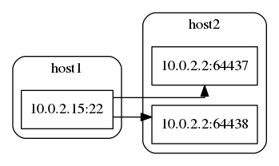

# lsof-graphviz

## Description

This is command line application for visualising network connections.

## Environment

* OS: CentOS 7
* Ruby: 2.4.0

### Prepare environment

```
# git clone https://github.com/mr-exz/lsof-graphviz.git
# cd lsof-graphviz
```

Create config.rb in ```./vagrant/lsof-graphviz``` directory.

```
# touch ./vagrant/lsof-graphviz/config.rb
# cat ./vagrant/lsof-graphviz/config.rb

APP_NAME='lsof-graphviz'    # constant for this project (Application name)
VM_NAME=APP_NAME            # constant for this project (Virtual machine name)
APP_HOME="~/lsof-graphviz/" # path to clonned project
```
Create your own ssh key.

```
# ssh-keygen -f ./vagrant/lsof-graphviz/vagrant
```

### Create VM

```
# cd ./vagrant/lsof-graphviz/
# vagrant up
```

### Login to VM

```
# vagrant ssh
```

## lsof-graphviz

### Usage

```
# vagrant ssh
# cd /opt/lsof-graphviz/bin
# ./draw.rb
```

After this result about connection would be saved inside ```../tmp/```.

### Example

